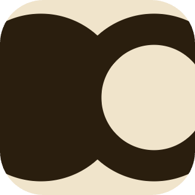

<div align="center">
  
  <h1>Swarm</h1>
</div>

---

A native macOS app for building, visualizing, and exporting family trees, aimed at
Russian-speaking genealogy. Trees are stored locally as GEDCOM files. Editing, search
and validation run offline; the map uses Apple Maps by default, with a fully offline
vector map available in Settings.

- **Platform:** macOS 14+, SwiftUI + AppKit
- **Toolchain:** Swift 5.9+ (developed against Swift 6.x), Swift Package Manager
- **Dependencies:** none (no third-party packages)

## Features

- Tidy tree diagram (Buchheim–Jünger–Leipert layout), ancestor fan chart, and a map of
  birth/death/burial places.
- Russian kinship naming — direct lineage, full/half siblings, cousins (incl. removed),
  and in-laws (свёкор/тесть, деверь/шурин, золовка/свояченица, …).
- Russian and English interface languages, selectable in Settings; Russian is the default.
- Photos and arbitrary file attachments per person.
- People, timeline, places, review, recovery, source/citation and structured-union
  workspaces designed for large local trees.
- GEDCOM 5.5.1 import/export that interoperates with Ancestry, Gramps, and MyHeritage,
  including standard map coordinates. Structures the app doesn't model (event-level
  notes, source records, custom tags) are **preserved through import → edit → export**,
  and the original imported file is kept verbatim as `original-import.ged`.

## Architecture

The code is split into two SPM targets so the domain logic can be tested independently
of the UI:

```
Swarm/
  Core/        → SwarmCore library (pure logic, no SwiftUI)
    Models/    → Person, Union, FamilyTree, FamilyIndex, FamilyDate, calculators
    Services/  → GEDCOMParser, GEDCOMSerializer, TreeStore, TreeLayoutEngine
    Resources/ → bundled GeoNames / places TSVs
  App/         → Swarm executable (SwiftUI views, theme, app entry)
Tests/
  SwarmCoreTests/   → Swift Testing suites and GEDCOM fixtures for the Core library
UITests/             → native XCUITest bundle only; no production sources
SwarmUI.xcworkspace/ → package + test-only Xcode host
```

**SwiftPM is the canonical production build.** Open the package directly in Xcode
(`File ▸ Open…` the folder) or build from the command line. The small project under
`UITests/` contains only an XCUITest bundle; it is combined with the Swift package by
`SwarmUI.xcworkspace` and does not duplicate production sources or dependencies.

### Storage model — GEDCOM is the source of truth

Trees live in `~/Library/Application Support/Swarm/`, one folder per tree:

```
<Tree Name>/
  ├── <Tree Name>.ged      — the tree itself (stable identity stored as the _TREEID tag)
  ├── original-import.ged  — verbatim copy of an imported file (if the tree was imported)
  ├── Media/               — person portrait photos (GEDCOM OBJE)
  └── Attachments/         — arbitrary files attached to people (GEDCOM _ATTC)
  └── .Swarm/
      ├── History/         — latest 50 previous GEDCOM revisions
      └── Trash/           — replaced/deleted files, retained for 30 days
Archived/                  — trees removed from the library but kept on disk
Recovery/<tree-id>/        — permanent pre-v2 and pre-merge full-bundle backups
```

Because identity lives inside the GEDCOM (`_TREEID`), the folder/file can be renamed
freely when the tree is renamed.

On first launch, Swarm moves the previous app storage into this location when the Swarm
folder does not already exist. If both folders exist, neither is merged or overwritten;
Swarm uses its own folder and shows the previous one in Finder for manual review.

**Custom tags** (beyond standard GEDCOM 5.5.1): `_FTSVER` and `_FTSID` remain stable
compatibility identifiers; tree metadata uses `_TREEID`, `_NAME`, `_SUBTITLE`, `_HOME`
and `_ROOT`; person data uses `_PATR`, `_MARNM` and `_ATTC`. Coordinates are written as
the **standard** `PLAC › MAP › LATI/LONG` triple so they interoperate with other tools;
legacy `_COORD lat lon` is still read, and used as a private fallback when coordinates
have no place to host a `MAP`.

### Privacy and maps

The default `appleMaps` provider renders through MapKit: Apple supplies its map tiles and
may receive the viewed region. Swarm does not intentionally submit names,
genealogy records, pins, or annotations. The `offlineVector` provider is a one-click
alternative in Settings that uses bundled Natural Earth vectors and the local place
index — it creates no MapKit view and requests no network tiles. Everything outside the
map (editing, search, place lookup, validation, storage) is offline under both providers.
The selected display text, dataset ID and coordinates are stored in the tree so a later
place-data update cannot silently move a historical place.

The internal build is not run in the macOS App Sandbox, so it can read GEDCOM files and
photos selected anywhere on disk. Accounts, cloud sync, analytics and AI services are not
present.

## Build & run

```sh
swift build       # build everything
swift run Swarm   # launch the app
```

Or use the VS Code launch configurations in `.vscode/launch.json`.

## Tests

```sh
./Scripts/run-tests.sh   # runs `swift test`
```

The suite uses [Swift Testing](https://developer.apple.com/documentation/testing)
(`import Testing`). On machines with only the Command Line Tools installed, SwiftPM
doesn't add the test frameworks to the search path automatically, so the wrapper script
passes them. Filesystem integration tests run serially for deterministic bundle swaps.

Coverage can be generated with:

```sh
swift test --enable-code-coverage
```

Native smoke tests require full Xcode: open `SwarmUI.xcworkspace` and run
the shared `Swarm-UI` scheme. Every launch receives an isolated
`--storage-folder`; the test host cannot touch a real library.

## Linting

Formatting is enforced with [SwiftFormat](https://github.com/nicklockwood/SwiftFormat)
using the conservative `.swiftformat` config:

```sh
brew install swiftformat
swiftformat --lint .     # check (CI runs this)
swiftformat .            # apply
```

## Release

`build_dmg.sh` builds a release binary, assembles the `.app` (copying both the app and
core resource bundles), runs tests, verifies the app and DMG, reports architecture and
signing status, and writes a `.sha256` checksum. The version is read from `VERSION`.

The current internal artifact is Apple-silicon and ad-hoc signed. Public Developer ID
signing, notarization, universal binaries and automatic updates require a separate
distribution decision. The script retains an explicit opt-in path for a future signed
internal candidate:

```sh
CODESIGN_IDENTITY="Developer ID Application: …" \
NOTARY_PROFILE="<notarytool keychain profile>" \
./build_dmg.sh
# or APPLE_ID / APPLE_TEAM_ID / APPLE_APP_PASSWORD instead of NOTARY_PROFILE
```

Without `CODESIGN_IDENTITY` the script ad-hoc-signs and skips notarization (local use
only; Gatekeeper will warn).

For isolated development and UI tests, launch with
`--storage-folder /absolute/path/to/temporary-library`.

## Continuous integration

`.github/workflows/ci.yml` runs on every push to `main` and every PR: it builds all
targets, runs the tests, and checks formatting. The job fails on any build error, test
failure, or formatting violation.
