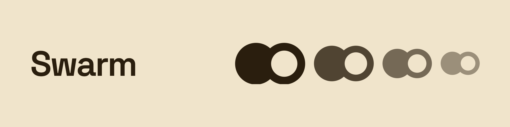

<div align="center">
  
  <br />
  <br />
  <a href="https://github.com/samoilev/swarm/actions/workflows/ci.yml"></a>
  <a href="https://github.com/samoilev/swarm/releases/latest"></a>
  <a href="LICENSE"></a>
  <br />
  
  
  
  <br />
  <br />
</div>

Swarm builds, visualizes and exports family trees, with particular attention to
Russian-language genealogy — full kinship terminology, patronymics, Cyrillic place data,
and the encodings that Soviet-era records arrive in.

Your trees are plain GEDCOM files in a folder you can open in Finder. There are no
accounts, no cloud sync, no analytics, and no AI services. Editing, search, validation
and place lookup all run offline.

- **Platform:** macOS 26+, SwiftUI + AppKit, Apple silicon
- **Toolchain:** Swift 6.0+, Swift Package Manager
- **Dependencies:** none — no third-party Swift packages
- **License:** [MIT](LICENSE)

## Install

Download the DMG from the [latest release](https://github.com/samoilev/swarm/releases/latest).

[Temporary] Build is not signed with an Apple Developer ID. 
Verify the download against its published checksum if you want to:

```sh
shasum -a 256 -c Swarm-3.0.0.dmg.sha256
```

Requires macOS 26 or later on Apple silicon. See [Build and run](#build-and-run).

## Features

- **Tree diagram** using the Buchheim–Jünger–Leipert layout, an **ancestor fan chart**,
  and a **map** of birth, death and burial places.
- **Russian and English kinship naming** — direct lineage, full and half siblings,
  neutral-sex relationships, cousins with exact removed generations, and in-laws
  (свёкор/тесть, деверь/шурин, золовка/свояченица, …). Ask “how are these two related?”
  about any pair and get the correct term.
- **Russian and English interfaces**, selected on first launch and switchable without
  restarting. Name order, sorting, examples, dates, plural grammar, Help, and PDF
  presentation follow the selected language.
- **Photos and arbitrary file attachments** on any person.
- **Workspaces built for large trees** — people, timeline, places, review, recovery, and
  sources and citations.
- **GEDCOM 5.5.1 import and export** that interoperates with Ancestry, Gramps and
  MyHeritage, standard map coordinates included. Structures Swarm doesn't model —
  event-level notes, source records, other programs' custom tags — survive
  import → edit → export unchanged, and the original imported file is kept verbatim as
  `original-import.ged`.
- **Merge someone else's tree into yours** — matching people are combined rather than
  duplicated, exact matches are found automatically, and likely matches are only
  suggested. A backup is taken first and any failure rolls back completely.

## Privacy

Genealogy data is other people's personal data, much of it about people who are still
alive. Swarm is built accordingly:

- **Nothing is uploaded.** No accounts, no sync, no telemetry, no crash reporting, no AI
  services.
- **Place lookup is entirely local.** Names are matched against a bundled snapshot of
  476,958 bilingual GeoNames places across the former USSR, Europe, and North America,
  so searching for a village sends nothing anywhere.
- **The map is the only optional network path.** The default `appleMaps` provider renders
  through MapKit, so Apple supplies the tiles and may receive the region being viewed.
  Swarm does not submit names, records, pins or annotations. The `offlineVector` provider
  in Settings replaces it with bundled Natural Earth vectors and the local place index —
  no MapKit view, no network tiles at all.
- Selected place text, dataset ID and coordinates are stored in the tree, so a later
  place-data update can never silently move a historical place.

## Storage model — GEDCOM is the source of truth

Trees live in `~/Library/Application Support/Swarm/`, one folder per tree:

```
<Tree Name>/
  ├── <Tree Name>.ged      — the tree itself (stable identity stored as the _TREEID tag)
  ├── original-import.ged  — verbatim copy of an imported file (if the tree was imported)
  ├── Media/               — person portrait photos (GEDCOM OBJE)
  ├── Attachments/         — arbitrary files attached to people (GEDCOM _ATTC)
  └── .Swarm/
      ├── History/         — latest 50 previous GEDCOM revisions
      └── Trash/           — replaced/deleted files, retained for 30 days
Archived/                  — trees removed from the library but kept on disk
Recovery/<tree-id>/        — permanent pre-v2 and pre-merge full-bundle backups
```

Because identity lives inside the GEDCOM (`_TREEID`), the folder and file can be renamed
freely when the tree is renamed.

Every save is written to a temporary folder, checksummed file by file, and swapped into
place only after it verifies — a crash or power cut mid-save cannot leave a half-written
archive.

On first launch, Swarm moves storage from the app's previous name into this location, as
long as the `Swarm` folder does not already exist. If both exist, neither is merged or
overwritten: Swarm uses its own folder and reveals the older one in Finder for manual
review.

**Custom tags** (beyond standard GEDCOM 5.5.1): `_FTSVER` and `_FTSID` remain stable
compatibility identifiers; tree metadata uses `_TREEID`, `_NAME`, `_SUBTITLE`, `_HOME`
and `_ROOT`; person data uses `_PATR`, `_MARNM` and `_ATTC`. Coordinates are written as
the **standard** `PLAC › MAP › LATI/LONG` triple so they interoperate with other tools;
legacy `_COORD lat lon` is still read, and used as a private fallback when coordinates
have no place to host a `MAP`.

## Build and run

```sh
git clone https://github.com/samoilev/swarm.git
cd swarm
swift build -c release
swift run -c release Swarm
```

`swift build` alone gives you a debug build, which is fine for development but noticeably
slower on large trees.

You can also open the package folder directly in Xcode (`File ▸ Open…`).

For isolated development, launch with
`--storage-folder /absolute/path/to/temporary-library` to keep a real library untouched.

## Contributing and support

- Bug reports and feature requests: [open an issue](https://github.com/samoilev/swarm/issues).
  **Never attach a real family GEDCOM** — see
  [CONTRIBUTING.md](CONTRIBUTING.md#never-attach-a-real-family-gedcom).
- Pull requests: not accepted yet. [CONTRIBUTING.md](CONTRIBUTING.md) explains why.
- Security issues: [SECURITY.md](SECURITY.md) — report privately, not as an issue.
- Getting help: [SUPPORT.md](SUPPORT.md).
- Changes by version: [CHANGELOG.md](CHANGELOG.md).

## License and attribution

Swarm's source code is [MIT licensed](LICENSE).

Bundled place and map data is third-party and carries its own terms — GeoNames under
CC BY 4.0, Natural Earth in the public domain. Full attribution is in
[THIRD_PARTY_NOTICES.md](THIRD_PARTY_NOTICES.md). The Swarm name and icon are not covered
by the MIT license; please rename and re-icon any fork you redistribute.
