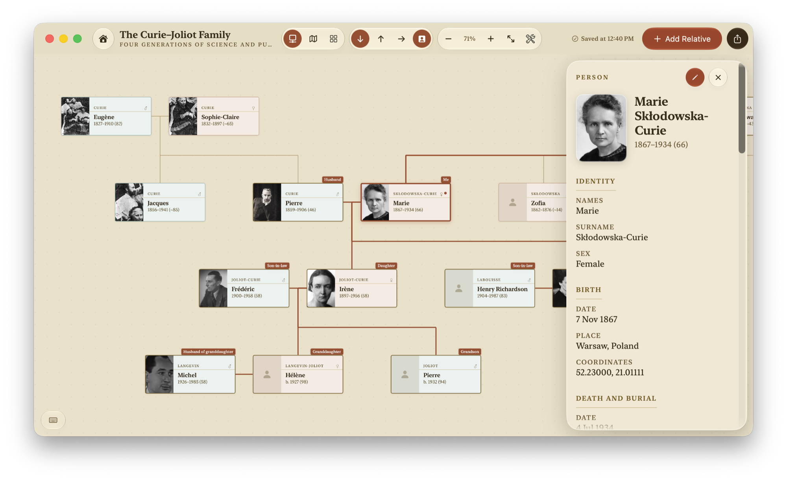
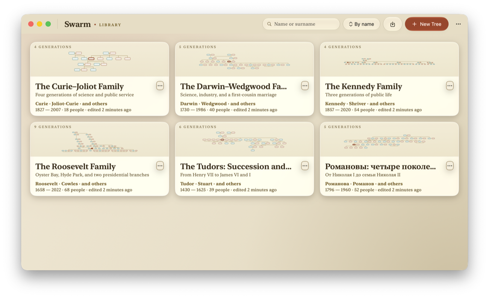
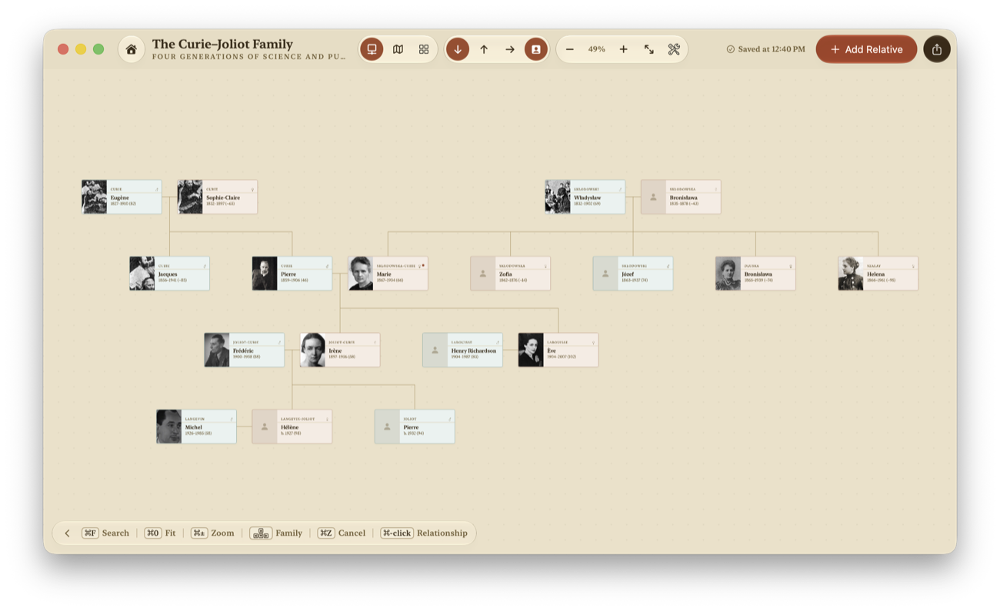
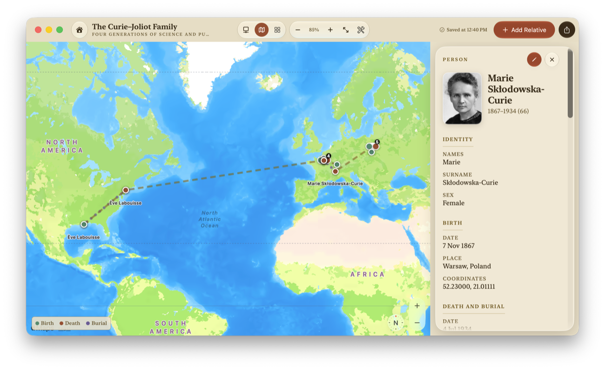
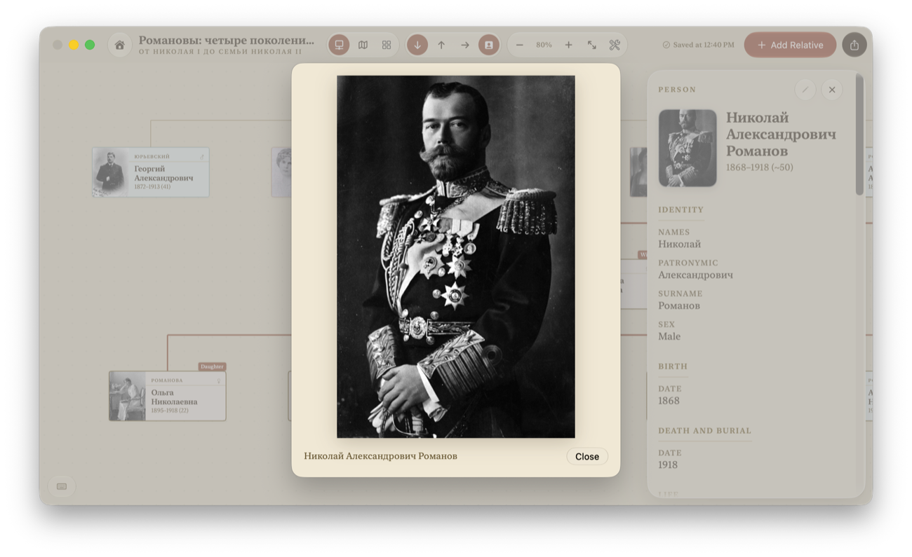

<div align="center">
  
  <br />
  <br />
  <a href="https://github.com/samoilev/swarm/actions/workflows/ci.yml"></a>
  <a href="https://github.com/samoilev/swarm/releases/latest"></a>
  <a href="LICENSE"></a>
  
  
  
</div>

## Swarm

Swarm builds, visualizes and exports family trees, with particular attention to
Russian-language genealogy — full kinship terminology, patronymics, Cyrillic place data,
and the encodings that Soviet-era records arrive in.

Your trees stay as plain GEDCOM files in a folder you can open in Finder. Native macOS,
Swift 6, no third-party packages.

## Quick look



<table>
  <tr>
    <td width="50%"></td>
    <td width="50%"></td>
  </tr>
  <tr>
    <td width="50%"></td>
    <td width="50%"></td>
  </tr>
</table>

## Install

Download the DMG from the [latest release](https://github.com/samoilev/swarm/releases/latest).
Requires macOS 26 or later on Apple silicon.

The build is not yet signed with an Apple Developer ID, so macOS will warn you on first
open. To check the download against its published checksum:

```sh
shasum -a 256 -c Swarm-3.3.0.dmg.sha256
```

## Features

- **Tree diagram** using the Buchheim–Jünger–Leipert layout, an **ancestor fan chart**,
  and a **map** of birth, death and burial places.
- **Russian and English kinship naming** — direct lineage, full and half siblings,
  neutral-sex relationships, cousins with exact removed generations, and in-laws
  (свёкор/тесть, деверь/шурин, золовка/свояченица, …). Ask “how are these two related?”
  about any pair and get the correct term.
- **Russian and English interfaces**, selected on first launch and switchable without
  restarting. Name order, sorting, examples, dates, plural grammar, Help, and PDF
  presentation follow the selected language.
- **Photos and arbitrary file attachments** on any person.
- **Workspaces built for large trees** — people, timeline, places, review, recovery, and
  sources with their citations.
- **GEDCOM 5.5.1 import and export** that interoperates with Ancestry, Gramps and
  MyHeritage, including standard map coordinates. Structures Swarm doesn't model —
  event-level notes, source records, other programs' custom tags — survive
  import → edit → export unchanged, and the original file is kept verbatim as
  `original-import.ged`.
- **Merge someone else's tree into yours.** Swarm combines matching people instead of
  duplicating them, finds the exact matches itself, and only suggests the likely ones. It
  takes a backup first, and any failure rolls back completely.
- **Nothing leaves the Mac.** No accounts, no sync, no telemetry, no AI. Place lookup
  runs against a bundled index of 476,958 bilingual GeoNames places, so searching for a
  village sends nothing anywhere. The map is the one optional network path: the default
  provider draws tiles through MapKit, and the `offlineVector` provider in Settings
  removes even that.

## Build and run

```sh
git clone https://github.com/samoilev/swarm.git
cd swarm
swift build -c release
swift run -c release Swarm
```

`swift build` alone gives you a debug build — fine for development, noticeably slower on
large trees. You can also open the package folder in Xcode (`File ▸ Open…`). To develop
against a throwaway library, launch with
`--storage-folder /absolute/path/to/temporary-library`.

## Example trees

Six historical families ship in [Examples/](Examples/), one folder per tree — the Curies,
Darwins, Kennedys, Romanovs, Roosevelts and Tudors, each with portraits, documents,
mapped places and source citations. Everyone in them is a public figure, so they are the
trees to open, screenshot and attach to a bug report. Credits are in
[Examples/CREDITS.csv](Examples/CREDITS.csv).

To import one, click **Import GEDCOM** in the tree library and select the tree's
**folder** — `Examples/tudor-succession/`, not the `.ged` inside it. Choosing the folder
is what lets Swarm pick up the `Media/` and `Attachments/` beside the GEDCOM. Then click
**Import Verified Copy** in the preview. The `Examples/` folder is only ever read, so you
can import the same tree as often as you like.

## Storage model

Trees live in `~/Library/Application Support/Swarm/`, one folder per tree:

```
<Tree Name>/
  ├── <Tree Name>.ged      — the tree itself
  ├── original-import.ged  — verbatim copy of an imported file
  ├── Media/               — portrait photos (GEDCOM OBJE)
  ├── Attachments/         — files attached to people (GEDCOM _ATTC)
  └── .Swarm/              — History/ (last 50 revisions) and Trash/ (30 days)
```

Identity lives inside the GEDCOM as a `_TREEID` tag, so the folder and file can be renamed
freely. Every save is written to a temporary folder, checksummed file by file, and swapped
into place only once it verifies — a crash mid-save cannot leave a half-written tree.

Custom tags beyond standard GEDCOM 5.5.1: `_TREEID`, `_NAME`, `_SUBTITLE`, `_HOME` and
`_ROOT` for tree metadata, `_PATR`, `_MARNM` and `_ATTC` on people, and `_FTSVER` /
`_FTSID` for compatibility with older versions. Coordinates are written as the standard
`PLAC › MAP › LATI/LONG` triple.

## License

Swarm is free software under the [GNU General Public License v3.0](LICENSE). Bundled
place and map data is third party and carries its own terms — GeoNames under CC BY 4.0,
Natural Earth in the public domain. See [THIRD_PARTY_NOTICES.md](THIRD_PARTY_NOTICES.md).

The Swarm name and icon are not covered by the GPL; please rename and re-icon any fork
you redistribute.

Bug reports: [open an issue](https://github.com/samoilev/swarm/issues), and never attach a
real family GEDCOM. Vulnerabilities: [SECURITY.md](SECURITY.md).
